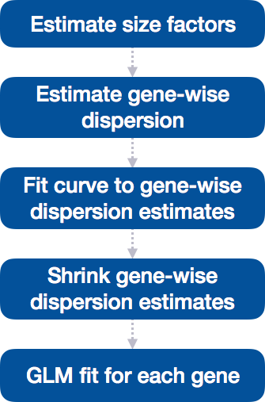
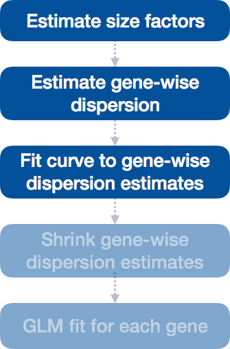

```{r setup, include=FALSE}
knitr::opts_chunk$set(echo = TRUE)
```

# Questions:

## answer biological questions:

* Is there a difference in expression betwen null and a given stimulus

```{r, out.width='90%', fig.align='center', fig.cap='differential expressed genes', echo=FALSE}
knitr::include_graphics('figures/tut45.png')
```


* Is there an age effect? For which genes?


```{r, out.width='90%', fig.align='center', fig.cap='differential expressed genes', echo=FALSE}
knitr::include_graphics('figures/tut47.png')
```

* Is there a CMV effect? for which genes?


```{r, out.width='90%', fig.align='center', fig.cap='differential expressed genes', echo=FALSE}
knitr::include_graphics('figures/tut46.png')
```

* Do the different lists of up or down regulated genes make any sense?
** Are they part of a known pathway?
** What is the overlapp between these lists?
** What other information can be gained/integrated?

* How would you propose to verify these results, or don't they need any verification?

## more technical questions

* Are there outliers?
* Did all experiments work to the same level?
* Which samples can be compared?
* Are there enough good samples to answer all questions?
* Which indications do we have for which of the previous conclusions?
* What happens when more samples (with potentially less quality) are included in the analysis?

# Getting started

Load the app using RStudio and calling 


Open RStudio and copy/paste the following to update the app 

```
library(devtools)
install_github("baj12/idealImmunoTP")
```

```
library(ideal)
ideal()
```

This will open a web-browser with the application. Please be a bit patient as it sometimes takes a few seconds to load everything. This holds true for most of the tabs. The only way to check if there is still something running is to check the process manager.


```{r, out.width='90%', fig.align='center', fig.cap='Overview, showing entry screen', echo=FALSE}

```

After the introduction screen is opened we are ready to load the data. To do so, please click on "Data Setup" (see arrow in figure above).


```{r, out.width='90%', fig.align='center', fig.cap='Data loading 1', echo=FALSE}
knitr::include_graphics('figures/tut2.png')
```

Here, we need to provide the actual count data (1) and the meta-data or information about the samples (2).

1. The count file is a comma-separated text file where the first row holds the sample names and the first column holds the gene names.
We use a manually modified version where we have changed the column names to follow the following convention. The name "D1a_O_L_L" can be read as **D**onor **1** of year **a** (a=1st year, b=2nd year,...) **_** who is **old** (vs. Y = young) **_** and was CMV positive (**P_**) (vs N) and was stimulated with LPS **L** (L = LPS, A = antiCD3/CD8, n = no stimmulation, P = polyIC). This conversion is done with a simple text editor. Excel could be used for this, but this has the tendancy to change values (e.g. Sep07 will be interpreted as a data and consequently be changed). Please see ([geneNamesRef.pdf](references/geneNameErrors.pdf)) for a more detailed discussion. 

We are providing the data from the previous years in the file called "allPreviousYears.csv" and the results from this year in the files "R_2019_grp12.xls"

```{r, out.width='90%', fig.align='center', fig.cap='A CSV file with the count data', echo=FALSE}

```

Though we have already encode most of the information about the samples in the name we still need to tell the program how to interprete the data. This, we do again using a TSV file that looks like this:

```{r, out.width='90%', fig.align='center', fig.cap='A tab delimited file with the meta data', echo=FALSE}

```

In this case, we are using "tabulators" instead of commas to separate the columns. Please also note the lines starting with **#**. Those lines will be ignored from both the meta data and the count data files. We have already removed most of the samples that didn't produce any useful data. There are still some that might be useable when sufficient other material is collected this year.

It is up to your biological and scientific knowledge/experience and scientific question that will guide you to what to include and exclude.

We can load multiple files. (This is one multiple modificatios I have introduced for this version of IDEAL.)
We will be loading the data from all previous years and this year (2019), see following figure.

```{r, out.width='90%', fig.align='center', fig.cap='Load multiple count data files', echo=FALSE}
knitr::include_graphics('figures/tut5.png')
```

Next, we load the meta data (2) using the file "target.all.txt". (No figure)

Please note, that as a result we notice changes highlighted in the following figure:


```{r, out.width='90%', fig.align='center', fig.cap='Step 2', echo=FALSE}
knitr::include_graphics('figures/tut6.png')
```


## Step 2

Now, we have to choose the design of our experiment under "Step 2".


## Excurs on DESeq2:

### DESeq2-normalized counts: Median of ratios method

see https://hbctraining.github.io/DGE_workshop/lessons/02_DGE_count_normalization.html


Since tools for differential expression analysis are comparing the counts between sample groups for the same gene, gene length does not need to be accounted for by the tool. However, **sequencing depth** and **RNA composition** do need to be taken into account.

To normalize for sequencing depth and RNA composition, DESeq2 uses the median of ratios method. On the user-end there is only one step, but on the back-end there are multiple steps involved, as described below.

> **NOTE:**  The steps below describe in detail some of the steps performed by DESeq2 when you run a single function to get DE genes. Basically, for a typical RNA-seq analysis, **you would not run these steps individually**.

**Step 1: creates a pseudo-reference sample (row-wise geometric mean)**

For each gene, a pseudo-reference sample is created that is equal to the geometric mean across all samples.

| gene | sampleA | sampleB | pseudo-reference sample  |
| ----- |:-----:|:-----:|:-----:|
| EF2A | 1489 | 906 | sqrt(1489 * 906) = **1161.5** |
| ABCD1 | 22 | 13 | sqrt(22 * 13) = **17.7** |
| ... | ... | ... | ... |

**Step 2: calculates ratio of each sample to the reference**

For every gene in a sample, the ratios (sample/ref) are calculated (as shown below). This is performed for each sample in the dataset. Since the majority of genes are not differentially expressed, the majority of genes in each sample should have similar ratios within the sample.

| gene | sampleA | sampleB | pseudo-reference sample  | ratio of sampleA/ref | ratio of sampleB/ref |
| ----- |:-----:|:-----:|:-----:| :-----: | :-----: |
| EF2A | 1489 | 906 | 1161.5 | 1489/1161.5 = **1.28** | 906/1161.5 = **0.78** |
| ABCD1 | 22 | 13 | 16.9 | 22/16.9 = **1.30** | 13/16.9 = **0.77** |
| MEFV | 793 | 410 | 570.2 | 793/570.2 = **1.39** | 410/570.2 = **0.72**
| BAG1 | 76 | 42 | 56.5 | 76/56.5 = **1.35** | 42/56.5 = **0.74**
| MOV10 | 521 | 1196 | 883.7 | 521/883.7 = **0.590** | 1196/883.7 = **1.35** |
| ... | ... | ... | ... |

**Step 3: calculate the normalization factor for each sample (size factor)**

The median value (column-wise for the above table) of all ratios for a given sample is taken as the normalization factor (size factor) for that sample, as calculated below. Notice that the differentially expressed genes should not affect the median value:

`normalization_factor_sampleA <- median(c(1.28, 1.3, 1.39, 1.35, 0.59))`

`normalization_factor_sampleB <- median(c(0.78, 0.77, 0.72, 0.74, 1.35))`
 
The figure below illustrates the median value for the distribution of all gene ratios for a single sample (frequency is on the y-axis).


```{r, out.width='90%', fig.align='center', fig.cap='deseq_median_of_ratios', echo=FALSE}
knitr::include_graphics("figures/deseq_median_of_ratios.png")
```

The median of ratios method makes the assumption that not ALL genes are differentially expressed; therefore, the normalization factors should account for sequencing depth and RNA composition of the sample (large outlier genes will not represent the median ratio values). **This method is robust to imbalance in up-/down-regulation and large numbers of differentially expressed genes.**

> Usually these size factors are around 1, if you see large variations between samples it is important to take note since it might indicate the presence of extreme outliers.

**Step 4: calculate the normalized count values using the normalization factor**

This is performed by dividing each raw count value in a given sample by that sample's normalization factor to generate normalized count values. This is performed for all count values (every gene in every sample). For example, if the median ratio for SampleA was 1.3 and the median ratio for SampleB was 0.77, you could calculate normalized counts as follows:

SampleA median ratio = 1.3

SampleB median ratio = 0.77

**Raw Counts**

| gene | sampleA | sampleB |  
| ----- |:-----:|:-----:|
| EF2A | 1489 | 906 | 
| ABCD1 | 22 | 13 | 
| ... | ... | ... | 

**Normalized Counts**

| gene | sampleA | sampleB |
| ----- |:-----:|:-----:|
| EF2A | 1489 / 1.3 = **1145.39** | 906 / 0.77 = **1176.62** | 
| ABCD1 | 22 / 1.3 = **16.92** | 13 / 0.77 = **16.88** | 
| ... | ... | ... | 

> Please note that normalized count values are not whole numbers.


### Differential expression analysis with DESeq2

(from: https://hbctraining.github.io/DGE_workshop/lessons/04_DGE_DESeq2_analysis.html)

The final step in the differential expression analysis workflow is fitting the NB model to the counts and performing the statistical test for differentially expressed genes. In this step we essentially want to determine whether the mean expression levels of different sample groups are significantly different.


*Image credit:  Paul  Pavlidis,  UBC*


The [DESeq2 paper](https://genomebiology.biomedcentral.com/articles/10.1186/s13059-014-0550-8) was published in 2014, but the package is continually updated and available for use in R through Bioconductor. It builds on good ideas for dispersion estimation and use of Generalized Linear Models from the [DSS](https://www.ncbi.nlm.nih.gov/pmc/articles/PMC4005660/) and [edgeR](https://www.ncbi.nlm.nih.gov/pmc/articles/PMC2796818/) methods. 

Differential expression analysis with DESeq2 involves multiple steps as displayed in the flowchart below in blue. Briefly, DESeq2 will model the raw counts, using normalization factors (size factors) to account for differences in library depth. Then, it will estimate the gene-wise dispersions and shrink these estimates to generate more accurate estimates of dispersion to model the counts. Finally, DESeq2 will fit the negative binomial model and perform hypothesis testing using the Wald test or Likelihood Ratio Test.


> **NOTE:** DESeq2 is actively maintained by the developers and continuously being updated. As such, it is important that you note the version you are working with. Recently, there have been some rather **big changes implemented** that impact the output. To find out more detail about the specific **modifications made to methods described in the original 2014 paper**, take a look at [this section in the DESeq2 vignette](http://bioconductor.org/packages/devel/bioc/vignettes/DESeq2/inst/doc/DESeq2.html#methods-changes-since-the-2014-deseq2-paper). 

#### Running DESeq2

Prior to performing the differential expression analysis, it is a good idea to know what **sources of variation** are present in your data, either by exploration during the QC and/or prior knowledge. Once you know the major sources of variation, you can remove them prior to analysis or control for them in the statistical model by including them in your **design formula**. 

Typically, you want to exclude Ribosomal and mitochondrial genes (genes that start with MT- or RB) because they are naturally enriched for in dying cells and are related to cell processes that are not interesting to the biological question. They are usually very highly expressed and perturb the distributions and estimates.

#### Design formula

A design formula tells the statistical software the known sources of variation to control for, as well as, the factor of interest to test for during differential expression testing. For example, if you know that sex is a significant source of variation in your data, then `sex` should be included in your model. **The design formula should have all of the factors in your metadata that account for major sources of variation in your data. **

For example, suppose you have the following metadata:


If you want to examine the expression differences between treatments, and you know that major sources of variation include `sex` and `age`, then your design formula would be:

`counts ~ sex + age + treatment`

This is how a model in R is represented. Note the **factors included in the design formula need to match the column names in the metadata**. 

##### Complex designs

DESeq2 also allows for the analysis of complex designs. You can explore interactions or 'the difference of differences' by specifying for it in the design formula. For example, if you wanted to explore the effect of sex on the treatment effect, you could specify for it in the design formula as follows: 

`design <- ~ sex + age + treatment + sex:treatment`

As recommended in the [DESeq2 vignette](https://www.bioconductor.org/packages/devel/bioc/vignettes/DESeq2/inst/doc/DESeq2.html#interactions), we could create a new factor variable in our metadata based on the two interaction factors as shown in the table below:


The design formula would be:

`design <- ~ age + treat_sex`

> **NOTE:** The design `~ sex + age + treatment + treat_sex` won't work (because the model can't be fit) because `treatment` and `treat_sex` are confounded (same goes for `sex`). Therefore, we drop the terms that went into `treat_sex` from the design formula.
>


Based on what we learned about the design of an experiment we are going to set the model to 

Stimulus + CMVstatus + age, with Stimulus = null as the reference.

Ideally, we would include the donor as a factor, but we don't have enough replicats.

```{r, out.width='90%', fig.align='center', fig.cap='Step 2 filled', echo=FALSE}
knitr::include_graphics('figures/tut7.png')
```

***

> **Excercise**
>
> Please try different models:
> 
> * just stimulus
* just CMVstatus
* stimulus + CMVStatus
* stimulus + age
* stimulus + age + CMVStatus
> 
> **Don't forget to remove samples again. (see below)**
>
 
***


After we generated the DESeq2 object, we can verify that all the parameters are correct:

```{r, out.width='90%', fig.align='center', fig.cap='verify DESeq2 object', echo=FALSE}
knitr::include_graphics('figures/tut8.png')
```


We can now also load additional annotation and select samples we would like to exclude (potential outliers). The annotation is needed later when we want to perform gene set enrichment analysis and other data integration processes. We will also see later during the quality control and data anlaysis which samples to exclude. The parameters for the annotation are already preset correctly. When working with different sources of count data this might have to be adjusted. This is dependant on the reference genome used for the alignment and the type of identifiers used. This is briefly described during the general bioinformatics presentation.

```{r, out.width='90%', fig.align='center', fig.cap='Annotation and sample selection', echo=FALSE}
knitr::include_graphics('figures/tut9.png')
```

***

> **Excercise**
>
> What is the right combinations of samples for each question:
> 
>
 
***


We can now calculate all the coefficients for the design / model that we selected. This will take a minute or two.

```{r, out.width='90%', fig.align='center', fig.cap='Run DESeq2', echo=FALSE}

```


### DESeq2 differential gene expression analysis workflow

With this GUI interface, we just completed the workflow for the differential gene expression analysis with DESeq2. The steps in the analysis are output below:



We will be taking a detailed look at each of these steps to better understand how DESeq2 is performing the statistical analysis and what metrics we should examine to explore the quality of our analysis.

#### Step 1: Estimate size factors

The first step in the differential expression analysis is to estimate the size factors, which is exactly what we already did to normalize the raw counts. 


To normalize the count data, DESeq2 calculates size factors for each sample using the *median of ratios method* as discussed previously.


#### Step 2: Estimate gene-wise dispersion

The next step in the differential expression analysis is the estimation of gene-wise dispersions. Before we get into the details, we should have a good idea about what dispersion is referring to in DESeq2.


**What is dispersion?** 

Dispersion is a measure of spread or variability in the data. Variance, standard deviation, IQR, among other measures, can all be used to measure dispersion. However, DESeq2 uses a specific measure of dispersion ( $ \alpha $ ) related to the mean ($ \mu $) and variance of the data: $Var = \mu + \alpha * \mu^2 $.  For genes with moderate to high count values, the square root of dispersion will be equal to the coefficient of variation ($Var / \mu $). So 0.01 dispersion means 10% variation around the mean expected across biological replicates. 

**What does the DESeq2 dispersion represent?** 

The DESeq2 dispersion estimates are **inversely related to the mean** and **directly related to variance**. **Based on this relationship, the dispersion is higher for small mean counts and lower for large mean counts.** The dispersion estimates for genes with the same mean will differ only based on their variance. **Therefore, the dispersion estimates reflect the variance in gene expression for a given mean value.** 

The following plot is not implemented in Ideal:

The plot of mean versus variance in count data below shows the variance in gene expression increases with the mean expression (each black dot is a gene). Notice that the relationship between mean and variance is linear on the log scale, and for higher means, we could predict the variance relatively accurately given the mean. However, **for low mean counts, the variance estimates have a much larger spread; therefore, the dispersion estimates will differ much more between genes with small means**. 


**How does the dispersion relate to our model?** 

To accurately model sequencing counts, we need to generate accurate estimates of within-group variation (variation between replicates of the same sample group) for each gene. With only a few (3-6) replicates per group, the **estimates of variation for each gene are often unreliable** (due to the large differences in dispersion for genes with similar means). 

To address this problem, DESeq2 **shares information across genes** to generate more accurate estimates of variation based on the mean expression level of the gene using a method called 'shrinkage'. **DESeq2 assumes that genes with similar expression levels have similar dispersion.** 

**Estimating the dispersion for each gene separately:**

To model the dispersion based on expression level (mean counts of replicates), the dispersion for each gene is estimated using maximum likelihood estimation. In other words, **given the count values of the replicates, the most likely estimate of dispersion is calculated**.

### Step 3: Fit curve to gene-wise dispersion estimates

The next step in the workflow is to fit a curve to the dispersion estimates for each gene. The idea behind fitting a curve to the data is that different genes will have different scales of biological variability, but, over all genes, there will be a distribution of reasonable estimates of dispersion. 



This curve is displayed as a red line in the figure below, which plots the estimate for the **expected dispersion value for genes of a given expression strength**. Each black dot is a gene with an associated mean expression level and maximum likelihood estimation (MLE) of the dispersion (Step 1).


### Step 4: Shrink gene-wise dispersion estimates toward the values predicted by the curve

The next step in the workflow is to shrink the gene-wise dispersion estimates toward the expected dispersion values.


The curve allows for more accurate identification of differentially expressed genes when sample sizes are small, and the strength of the shrinkage for each gene depends on :
	
- how close gene dispersions are from the curve 
- sample size (more samples = less shrinkage)

**This shrinkage method is particularly important to reduce false positives in the differential expression analysis.** Genes with low dispersion estimates are shrunken towards the curve, and the more accurate, higher shrunken values are output for fitting of the model and differential expression testing.

Dispersion estimates that are slightly above the curve are also shrunk toward the curve for better dispersion estimation; however, genes with extremely high dispersion values are not. This is due to the likelihood that the gene does not follow the modeling assumptions and has higher variability than others for biological or technical reasons [[1](https://genomebiology.biomedcentral.com/articles/10.1186/s13059-014-0550-8)]. Shrinking the values toward the curve could result in false positives, so these values are not shrunken. These genes are shown surrounded by blue circles below. 


**This is a good plot to examine to ensure your data is a good fit for the DESeq2 model.** You expect your data to generally scatter around the curve, with the dispersion decreasing with increasing mean expression levels. If you see a cloud or different shapes, then you might want to explore your data more to see if you have contamination (mitochondrial, etc.) or outlier samples.  Note how much shrinkage you get across the whole range of means in the `plotDispEsts()` plot for any experiment with low degrees of freedom.


***

> **Excercise**
>
> compare to what happens when the MT/RB genes are included.
> 
>
 
***

Examples of **worrisome dispersion plots** are shown below:


After this has finished we are ready to look at some of the results. We first see how many genes are up/down regulated

```{r, out.width='90%', fig.align='center', fig.cap='DESeq2 finished', echo=FALSE}
knitr::include_graphics('figures/tut11.png')
```


## Dispersion

```{r, out.width='90%', fig.align='center', fig.cap='Dispersion plot', echo=FALSE}

```

**Do you think our data are a good fit for the model?**


We can equally see how the samples compare when looking at the genes with no expression (zero counts), and the number of aligned sequences.
The two table are there to check that the input has been correctly loaded.

```{r, out.width='90%', fig.align='center', fig.cap='Summary stats', echo=FALSE}

```

In the "Counts overview" we can perform mnore quality controls.

```{r, out.width='90%', fig.align='center', fig.cap='Count overview', echo=FALSE}
knitr::include_graphics('figures/tut14.png')
```

1). The checkmarks indicate what we have done so far.
2). Similar information is available on the top of the page
3). We have now moved to the "Counts overview" tab.

The following tables are available

```{r, out.width='40%', fig.align='center', fig.cap='Selection for table', echo=FALSE}
knitr::include_graphics('figures/tut15.png')
```


<a style="color:red">Explain different tables</a>


Filter out genes that are not well expressed.

```{r, out.width='90%', fig.align='center', fig.cap='Filter genes', echo=FALSE}
knitr::include_graphics('figures/tut16.png')
```


Pearson
Spearman
Kendal 
Distance measures

Pairwise correlation


```{r, out.width='90%', fig.align='center', fig.cap='Pairwise correlation', echo=FALSE}
knitr::include_graphics('figures/tut17.png')
```

Correlation between samples shows which samples are correlated using a heatmap. Potentially mislabeled samples can be identified.

```{r, out.width='90%', fig.align='center', fig.cap='Correlation between samples', echo=FALSE}

```

We have to set the "Group/color by:" to show the PCA and size factors:


```{r, out.width='90%', fig.align='center', fig.cap='Highest expressing genes', echo=FALSE}

```

The PCA and size factor visualizations show us which factors are determining the differences between the samples. I.e. by changing the "group" we can see which PCA groups are built.

We can also identify the highest expressing genes and see who they correlate with the samples.


```{r, out.width='90%', fig.align='center', fig.cap='Extract results', echo=FALSE}
knitr::include_graphics('figures/tut21.png')
```


```{r, out.width='40%', fig.align='center', fig.cap='choose factor', echo=FALSE}

```


After clicking on the "Extract results" button we have everything for the following analyses.

```{r, out.width='90%', fig.align='center', fig.cap='results are available', echo=FALSE}
knitr::include_graphics('figures/tut22.png')
```

We see that there are 577 genes up-regulated for the comparison null vs. polyIC.

Sortable table with p-values and links to ENSEMBL:

```{r, out.width='90%', fig.align='center', fig.cap='results table', echo=FALSE}
knitr::include_graphics('figures/tut23.png')
```

Diagnostic plots:

P-value distribution

P-value distribution for ranges of mean expression values.

log2 fold change histogram.


```{r, out.width='90%', fig.align='center', fig.cap='results histograms', echo=FALSE}

```

Summary Plots

this takes a few seconds to calculate

<a style="color:red">Explain MA plot</a>


Select a region in the MA plot

```{r, out.width='90%', fig.align='center', fig.cap='Summary Plots', echo=FALSE}
knitr::include_graphics('figures/tut25.png')
```

Then click on a gene in right plot.

We then get detailed information on that gene, its expression over the groups that are selected on the left panel and information from the Web on that gene.

```{r, out.width='90%', fig.align='center', fig.cap='info on Genes', echo=FALSE}

```


Volcano plot

```{r, out.width='90%', fig.align='center', fig.cap='Volcano plot', echo=FALSE}
knitr::include_graphics('figures/tut27.png')
```

Resizable heatmap of selected genes.

The right heatmap is zoomable.

```{r, out.width='90%', fig.align='center', fig.cap='Heatmap of selected genes', echo=FALSE}
knitr::include_graphics('figures/tut28.png')
```


```{r, out.width='90%', fig.align='center', fig.cap='zoomed heatmap', echo=FALSE}
knitr::include_graphics('figures/tut29.png')
```

Table of zoomed region in MA plot.

```{r, out.width='90%', fig.align='center', fig.cap='Table of zoomed region', echo=FALSE}

```

# Gene Finder

Select genes of interest on the left panel.

```{r, out.width='90%', fig.align='center', fig.cap='Gene Finder', echo=FALSE}

```

With additional group

```{r, out.width='90%', fig.align='center', fig.cap='Gene Finder', echo=FALSE}

```

We can also visualize the coefficients for the first gene selected.

```{r, out.width='90%', fig.align='center', fig.cap='Gene Finder', echo=FALSE}

```

Those genes are also highlighted in the MA plot and its statistic values are displayed in a table.

```{r, out.width='90%', fig.align='center', fig.cap='Gene Finder', echo=FALSE}

```

Given a text file with gene names (one per line) we can visualize those in the fashion:
Here we have a list of genes that are associated to cytokine responds.

```{r, out.width='90%', fig.align='center', fig.cap='Gene Finder', echo=FALSE}
knitr::include_graphics('figures/tut35.png')
```

Functional analysis

```{r, out.width='90%', fig.align='center', fig.cap='Gene Finder', echo=FALSE}

```


## Functional Analysis


The Functional Analysis tab takes the user from the simple lists of DE genes to insight on the affected biological pathways, with three approaches based on the Gene Ontology (GO) databases.
This panel of ideal has a slim interface to the following methods for performing functional analysis:

- `limma::goana` for the quick yet standard implementation
- `topGO`, particularly valuable for pruning terms which are topologically less meaningful than their specific nodes
- `goseq`, which accounts for the specific length bias intrinsic in RNA-Seq assays (longer genes have higher chances of being called DE).

"ideal" allows the user to work simultaneously with more gene lists, two of which can be uploaded in a custom way (e.g. list of gene families, or extracted from other existing publications). 

The interaction among these lists can be visually represented in Venn diagrams, as well as with the appealing alternative from the UpSetR package, where all combination of sets are explicitly shown. 

Each of the methods for GO enrichment delivers its own interactive `DT`-based table, which can then be explored interactively with the display of a heatmap for all the (DE) genes annotated to a particular term, picking the normalized transformed values for comparing robustly the expression values. 
This is simply triggered by clicking any of the rows for the results tables. 
Another useful feature is provided by the clickable link to the AmiGO database on each of the GO term identifiers.


Gene set enrichment analysis

1. We are now in the Functoinal analysis panel.
2. Select a Gene ontology
3. Select up or down or both or one or two manually defined list of genes.
4. calculate the enrichment
5. the progress is shown on the bottom right.

These calculations will take a few minutes.


Table with GO enrichments. Links out to external web-pages.


```{r, out.width='90%', fig.align='center', fig.cap='GO table (goanna)', echo=FALSE}

```


GO top table with heatmap.

```{r, out.width='90%', fig.align='center', fig.cap='GO table (gotop)', echo=FALSE}
knitr::include_graphics('figures/tut38.png')
```


Set operations. Here we have loaded again the cytokineResponds.list.txt


```{r, out.width='90%', fig.align='center', fig.cap='set operations', echo=FALSE}

```

Once expanded, the table allows identifying the genes that are in each category.

```{r, out.width='90%', fig.align='center', fig.cap='set operations table', echo=FALSE}

```


## Signatures Explorer

The Signatures Explorer tab allows the user to check the behavior of a number of provided gene signatures in the data at hand, displaying this as a heatmap.

This panel is composed by different well panels:

- in the Setup Options, you can select and upload a gene signature file, in `gmt` format (e.g. like the ones provided in the MSigDB database, or from WikiPathways), and quickly compute the variance stabilized transformed version of your data, which is more amenable for visualization than raw or normalized counts

- in the Conversion options tab, you can create an annotation vector, used to bring the ids from your data and the ids the `gmt` used for encoding the signature elements. 
  This works based on the `org.XX.eg.db` packages.

- the lower well panels control the appearance of the heatmap, also with an option to display all genes annotated in that pathway, or only the ones detected as differentially expressed (for this you need to provide or compute the result object)


The signature analysis allows to compare to analysis stored for key experiments for signature genes.
Those lists can be retrieved from the Broad institute (http://software.broadinstitute.org/gsea/msigdb/index.jsp).
The immunology gene sets (C7) are the most interesting to us.


```{r, out.width='90%', fig.align='center', fig.cap='signature analysis', echo=FALSE}

```

1. we are now in the Signature analysis
2. select the C7 set
3. to make the correspondance between our annotation and the one used by the Broad we set the coresponding values.
4. Here, we compare to the Flu vs. coli infection of PBMC up regulated genes
5. We should cluster by column/sample to have the best visual impression.
6. <a style="color:red">Don't know what this does.</a>

Using per row standardization and only our differentially expressed genes give the following heatmap:

```{r, out.width='90%', fig.align='center', fig.cap='signature analysis heatmap', echo=FALSE}
knitr::include_graphics('figures/tut41.png')
```


## Report

Creating the preview will take a few minutes.

This allows creating a report of what we have done for reproducibility.

```{r, out.width='90%', fig.align='center', fig.cap='Report generator', echo=FALSE}

```

There are several option we can choose from to create a report, either in R-markdown or as an HTML report

```{r, out.width='90%', fig.align='center', fig.cap='Report generator with options', echo=FALSE}
knitr::include_graphics('figures/tut43.png')
```


